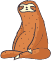
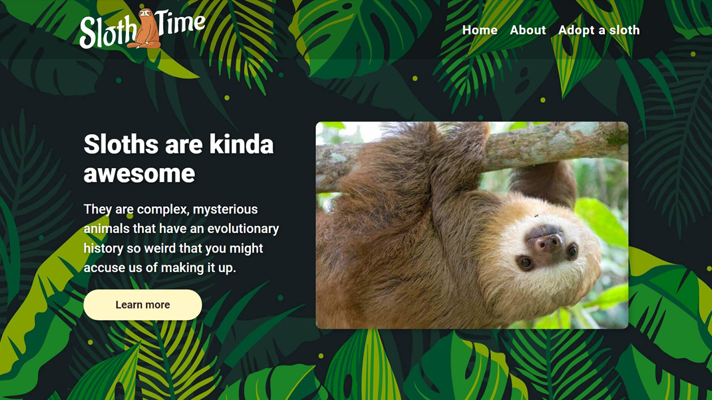

#  Sloth Time

## Description

This is an assignment from the [Odin Project](https://www.theodinproject.com/paths/foundations/courses/foundations/lessons/landing-page) to practice the fundamentals of HTML and CSS.

The purpose of this assignment is to build an HTML page and style it as close as possible to the provided [design](https://cdn.statically.io/gh/TheOdinProject/curriculum/main/foundations/html_css/project/odin-project.png).

[Live Demo](https://thecolordude.github.io/sloth-time/)

## Languages & Tools

The following were used for the creation of this project:

## Resources

*   Text and images from [slothconservation.org](https://slothconservation.org)
*   Vector used in logo from [vecteezy.com](https://www.vecteezy.com/vector-art/210862-sloth-vector)
*   Font used in logo is [Aladin](https://fonts.google.com/specimen/Aladin)
*   Tropical background from [freepik.com](https://www.freepik.com/free-vector/hand-drawn-tropical-leaves-background_13840094.htm)
*   Sloth vectors from [vecteezy.com](https://www.vecteezy.com/vector-art/210861-hand-drawn-sloth-vector)
*   Quote from [azquotes.com](https://www.azquotes.com/quotes/topics/sloth.html)
*   Avocado background from [vecteezy.com](https://www.vecteezy.com/vector-art/5073990-green-avocado-pattern-seamless-background)
